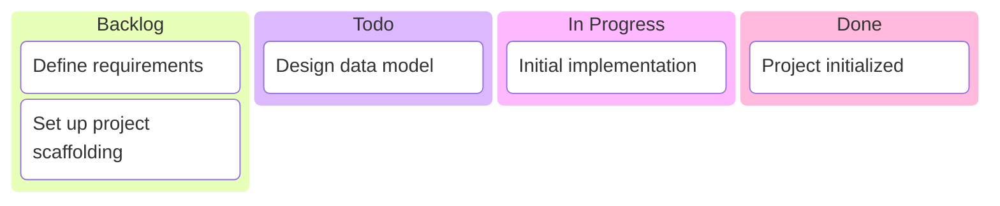

# General Webscraper - Tracker

> Placeholder kanban board - replace items with real tracked work.

```mermaid
kanban
  Backlog
    b1[Define requirements]
    b2[Set up project scaffolding]
  Todo
    b3[Design data model]
  In Progress
    b4[Initial implementation]
  Done
    b5[Project initialized]
```

## Notes

- _TODO: link tickets/issues here_
- _TODO: track blockers and decisions_