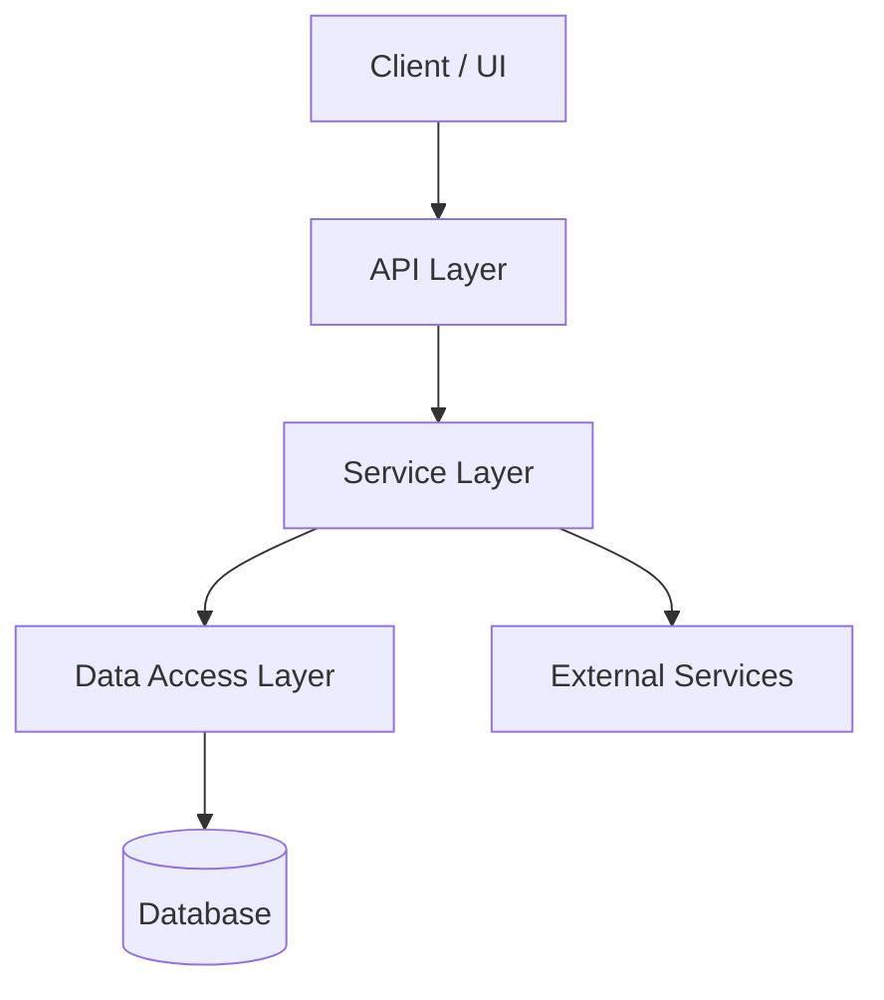
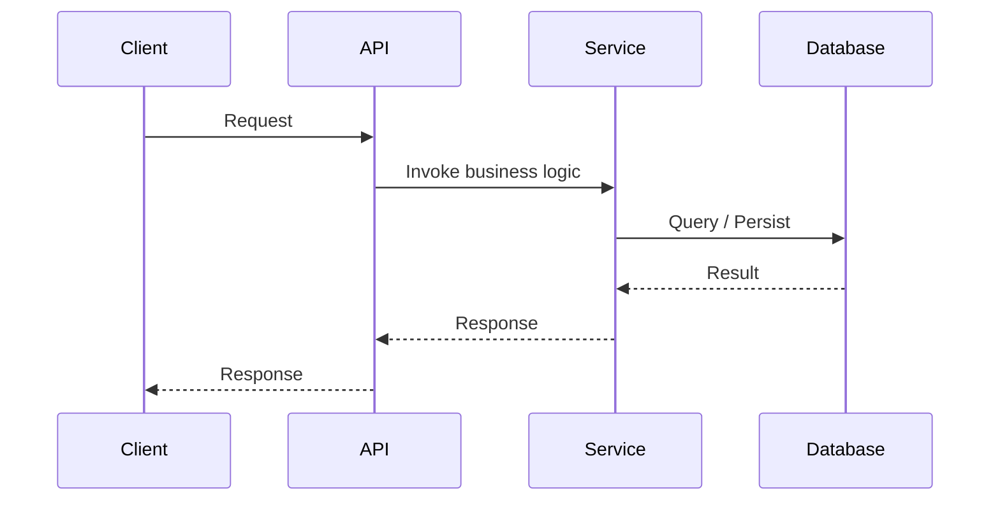

# Skill Wave - Architecture

> Placeholder - replace with the actual architecture once decided.

## Overview

_TODO: describe what Skill Wave does, its tech stack, and how its pieces fit together._

## Component Diagram

## Sequence Diagram (example flow)

## Notes

- _TODO: list key modules/components_
- _TODO: list external integrations_
- _TODO: deployment/runtime notes_